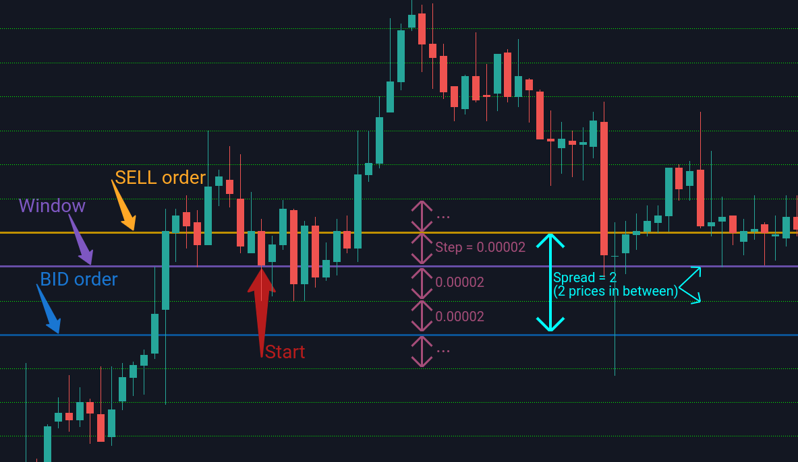

# Binance Stepper Bot

The 'binance-stepper-bot' is a terminal-based, **trading automation program** for [Binance Exchange](https://www.binance.com/en) written in Python.

It is designed to be robust and reliable, so it only utilizes usual _SELL_ and _BUY_ limit orders, each following trade is placed based on the pre-generated array of prices and has only two orders out on the market at the same time.

Program is capable of sending you daily/weekly/monthly CSV reports with the number of completed trades and estimated profit. It also saves each and every order it places on the market in a CSV file, thus creating monthly trading history.

Created using [python-binance](https://github.com/sammchardy/python-binance) - amazing python library for Binance API.

## Setting up

#### Bot-side

1. Make sure you have Python >= 3.6 installed
2. Download all the project files to your machine or clone it:

```
git clone https://github.com/aleksgaisov/binance-stepper-bot
```

3. Install all the necessary dependencies listed in _requirements.txt_:

```
pip3 install -r requirements.txt
```

List:

```
python-binance
requests
autobahn
certifi
chardet
cryptography
dateparser
pyOpenSSL
service-identity
Twisted
```

4. Make sure that you have set a correct local time on your machine to avoid server _time-stamp_ errors

#### Exchange-side

1. [Register/Log-in](https://accounts.binance.com/en/login) to Binance Exchange
2. Apply all the necessary security measures to protect your account, including Two-Factor Authentication.
3. Go to [API Manager](https://www.binance.com/en/usercenter/settings/api-management) and create new API with the following restrictions:

```
[*] Read Only    [*] Enable Trading    [] Enable Withdrawals

Optional: Consider restricting API access to trusted IPs only
```

4. Save your API and Secret keys

#### Email-side

This bot can email you reports based on its activity on the market. It uses Gmail as SMTP provider, meaning that you have to have at least one Gmail account in order to unitize it for emailing. Follow the steps to allow it to send you reports.

1. [Allow less secure apps](https://www.google.com/settings/security/lesssecureapps) to access your account
2. [Display unlock captcha](https://accounts.google.com/DisplayUnlockCaptcha) to prevent _SMTPAuthenticationError_ with code 534

## Configuration

Configuration of the trading bot takes place in the main module _base.py_ via constant variables:

|       Constant       |                      Description                     |
|:--------------------:|:----------------------------------------------------:|
| API_KEY              | Binance API key                                      |
| API_SECRET           | Binance API secret key                               |
| TRADING_COIN         | Cryptocurrency you want to trade for (ex. ETH)       |
| TRADING_ASSET        | Cryptocurrency you want to trade against (ex. BTC)   |
| STEP                 | Distance between order prices (ex. 0.00002)          |
| SPREAD               | Number of 'STEP' values between orders (ex. 3)       |
| LOT                  | Quantity of 'TRADING_COIN' per order                 |
| MAIL_DAILY_REPORTS   | If you want to generate and mail you daily reports   |
| MAIL_WEEKLY_REPORTS  | If you want to generate and mail you weekly reports  |
| MAIL_MONTHLY_REPORTS | If you want to generate and mail you monthly reports |
| SENDER_ADDRESS       | Gmail address to send reports from                   |
| SENDER_PASS          | 'SENDER_ADDRESS' password                            |
| RECEIVER_ADDRESS     | Any email address to receive reports to              |

## Trading Algorithm

#### Step and Spread

In order to set the optimal values inside config file you should first get a brief idea of how do the orders are being generated and how do the values of **step** and **spread** affect them.

It is easy to demonstrate on an example with arbitrary values:

Imagine trading BTC against ETH (thus, ETH/BTC pair). Therefore, the values for **asset** and **coin** inside config file would be:

```
asset: "BTC"
coin: "ETH"
```

Then you decide that a reasonable values for **step** and **spread** are:

```
step: 0.00002
spread: 2
```

To visualize it on the chart:



Therefore, all _BUY_ and _SELL_ orders will be placed with **spread** skipped entries in between. Distance between all the pre-generated entries is equal to **step**. As the trading goes, orders will be moved _UP_ or _DOWN_ by one entry keeping the distance the same. 

## Usage

The program is designed for terminals, therefore, it should be executed within one. To start the bot run the main module _base.py_ by:

```
python3 base.py
```

Then confirm that the information about traded coin pair, step, spread and amount of coins per order is correct by typing in _'y'_, or enter _'n'_ to exit. You can stop the trading process at any time by pressing the universal 'Ctrl+C' combination.

## Disclaimer

```
Please notice that I am not responsible or liable for anything you do with this program.
This libre piece of software is distributed without any warranties or guarantees.
You use this program at your own risk.
```
