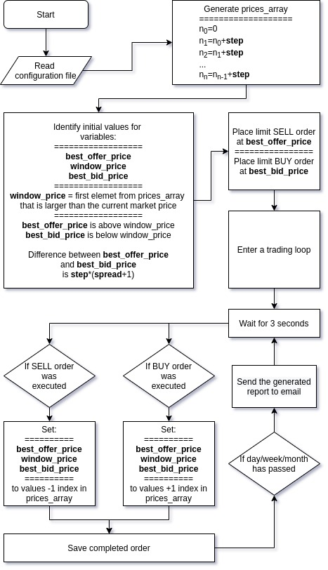

# Binance Stepper Bot

The 'binance-stepper-bot' is a **trading automation program** for [Binance Exchange](https://www.binance.com/en) written in Python.

It is designed to be robust and reliable, so it only utilizes usual _SELL_ and _BUY_ limit orders, each following trade is placed based on the pre-generated array of prices and has only two orders out on the market at the same time.

Program is capable of sending you daily/weekly/monthly CSV reports with the number of completed trades and estimated profit. It also saves each and every order it places on the market in a CSV file, thus creating monthly trading history.

## Setting up

#### Bot-side

1. Make sure you have Python >= 3.7 installed
2. Download all the repository files to your machine or clone it:

```
git clone https://github.com/aleksgaisov/binance-stepper-bot
```
3. Install all the necessary dependencies listed in _requirements.txt_:

```
pip3 install -r requirements.txt
```

List:

```
python-binance
requests
autobahn
certifi
chardet
cryptography
dateparser
pyOpenSSL
service-identity
Twisted
```

4. Make sure that you have set a correct local time on your machine to avoid server _time-stamp_ errors

#### Exchange-side

1. [Register/Log-in](https://accounts.binance.com/en/login) to Binance Exchange
2. Apply all the necessary security measures to protect your account, including Two-Factor Authentication.
3. Go to [API Manager](https://www.binance.com/en/usercenter/settings/api-management) and create new API with the following restrictions:

```
[*] Read Only    [*] Enable Trading    [] Enable Withdrawals

Optional: Consider restricting API access to trusted IPs only
```

4. Save your API and Secret keys

#### Email-side

This bot can email you reports based on its activity on the market. It uses Gmail as SMTP provider, meaning that you have to have at least one Gmail account in order to unitize it for emailing. Follow the steps to allow it to send you reports.

1. [Allow less secure apps](https://www.google.com/settings/security/lesssecureapps) to access your account
2. [Display unlock captcha](https://accounts.google.com/DisplayUnlockCaptcha) to prevent _SMTPAuthenticationError_ with code 534

## Configuration

The program uses _config.json_ file for basic configuration settings. It is divided in two entries: _Binance\_bot_ and _Email\_sender_.

| Setting          | Description                                                               |
|------------------|---------------------------------------------------------------------------|
| api_key          | Binance API key                                                           |
| api_secret       | Binance API secret key                                                    |
| asset            | cryptocurrency listed on Binance you want to buy your coin with (ex. BTC) |
| coin             | cryptocurrency listed on Binance you want to sell for you asset (ex. ETH) |
| spread           | number of step values between your BUY and SELL order >= 0 (ex. 2)        |
| step             | distance between prices >= 0 (ex. 0.00002)                                |
| conins_per_order | amount of coin for each trade (ex. 5)                                     |
| sender_address   | email address to reports emails from                                      |
| sedner_pass      | password from sender email                                                |
| receiver_adderss | email address to send reports to (could be the same as sender address)    |

Some unimplemented configuration, like: toggle emailing, using different SMTP provider, frequency of report generation, frequency of market review should be done by commenting out appropriate source code section. For now.

## Trading Algorithm

#### Flow Chart

Simplified version of the general algorithm can be viewed on the flowchart below:



#### Step and Spread

In order to set the optimal values inside config file you should first get a brief idea of how do the orders are being generated and how do the values of **step** and **spread** affect them.

It is easy to demonstrate on an example with arbitrary values:

Imagine trading BTC against ETH (thus, ETH/BTC pair). Therefore, the values for **asset** and **coin** inside config file would be:

```
asset: "BTC"
coin: "ETH"
```

Then you decide that a reasonable values for **step** and **spread** are:

```
step: 0.00002
spread: 2
```

To visualize, on a chart it would look like that:

## Usage

## Disclaimer
